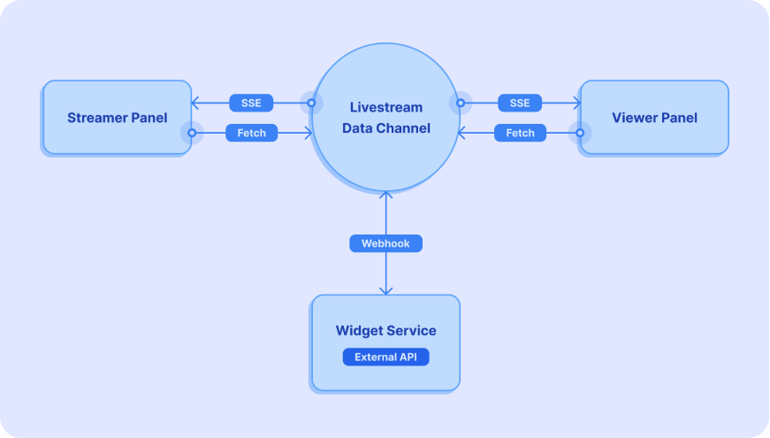

---
# Refer to the themes/inlive/archetypes/README.md
date: 2022-07-15
lastmod: 2022-07-15
title: Real-Time Widget API announcement
description: inLive announces the beta version release of Real-Time Widget API that let users focus on building their interactive widgets by providing the server.
slug: real-time-widget-api-announcement
summary: We are excited to introduce to you the beta version of Real-Time Widget API, which saves you time to develop interactive widgets for your live stream by providing the server while you can focus on building your widgets.
---

# Introducing inLive Real-Time Widget API: Interaction beyond likes and comments

Today’s online interactions in live streams are often limited to likes and comments, opposite to what we can do in real-life events. Events like classes, exhibitions, sports matches, concerts, and many more can have multiple ways of interactions that can’t be accommodated when it’s held online by current live streaming platforms.

As we want to ensure that online interaction is as engaging as real-life events, we also wanted the development of interactive features on live streams to be simple and easy for all. Thus, we’re excited to introduce you to the **Real-Time Widget API** (Beta).

Available now to all users, Real-Time Widget API saves you time to develop interactive widgets for your live stream, by providing the server while you can focus on building your widgets.

♾️ **Endless possibilities**: discover endless possibilities of interactions, flexible and fully customizable, the sky is the limit

⌛ **Real-time communication**: solve latency issues with a real-time communication scheme

📄 **Documentation & samples**: documentation and code samples for more convenient interactive widget development

🏷️ **Flexible pricing**: transparent and flexible pricing plan for all, enjoy Real-Time Widget API for **free** during the beta

Real-Time Widget API works by using a data channel server that can receive and send messages between the streamer and viewers. This channel server also allows webhook connections for more complex functionalities that need communication with external third-party services.

We can’t wait to see all the ways Real-Time Widget API helps you take your live stream to new heights!

[Click here](/docs/real-time-widget-api/) to learn more and get started today!
