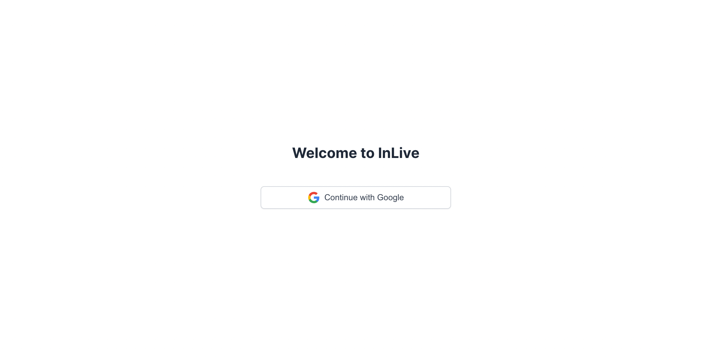
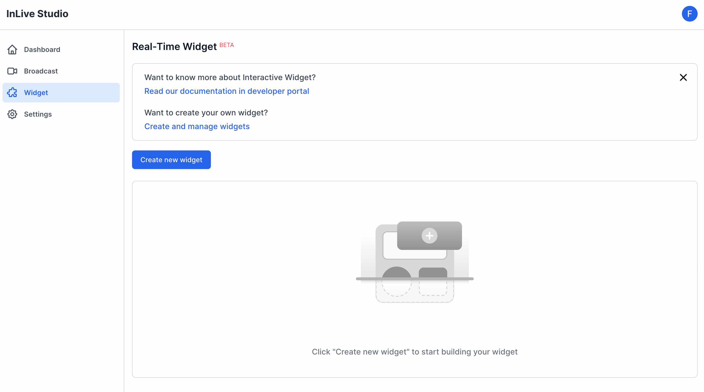
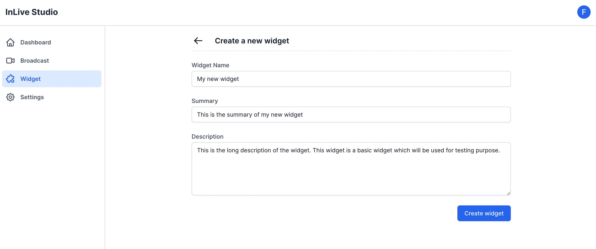
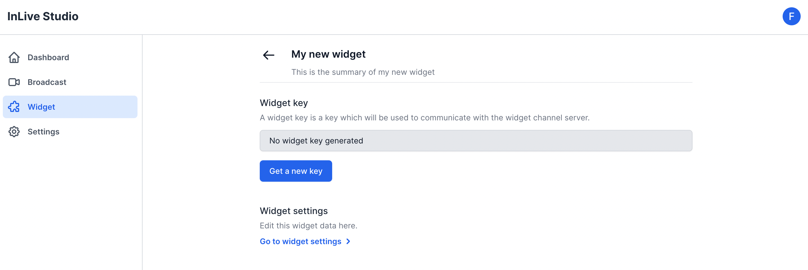

# How to Create & Manage your Widget
### Introduction
In this tutorial, we will walk you through on how to create and manage your widget from registering it through the InLive Studio website, Updating information about the widget, deleting the widget and lastly generating the widget key for you to be able to use our API.

## Prerequisites
-   A basic understanding of using the web browser
-   A Google Account to login into the InLive Studio website
## Logging in to the InLive Studio website

The first step is to navigate to the InLive Studio website, you can access it by clicking the following URL [https://studio.inlive.app](https://studio.inlive.app). Once you open the URL you will be greeted with a login request. Currently the website only supports login with a Google Account.

The login page should be similar to the screen capture below : 

## Navigating to the Widget List

The next step is navigating to the widget page. You can easily go to the widget page by clicking the page on the left side navigation menu. Or you can copy and paste this URL [https://studio.inlive.app/widget/](https://studio.inlive.app/widget/) into a browser address bar. Since it’s your first time you will be asked to create a new widget.

Screen capture of the widget list page: 

## Creating a New Widget

To create a widget, simply press the “create widget” button. Then you need to fill out the form. The name is mandatory and you can also write the summary and the description for the widget.

## Generating the Widget Key

After successfully creating the widget, you will be redirected to the widget page that you just created. You need a widget key if you want to communicate with the widget channel server (examples: send and retrieve the messages). To generate the key, simply click the “Get a new key” button, you can always regenerate the key by clicking the button again.

## Updating and Deleting the Widget

If you need to update the information of the widget, simply navigate to the widget settings. You can update the name, summary, and description.

If needed, you can also delete the widget, but keep in mind that this action is **not reversible**.
